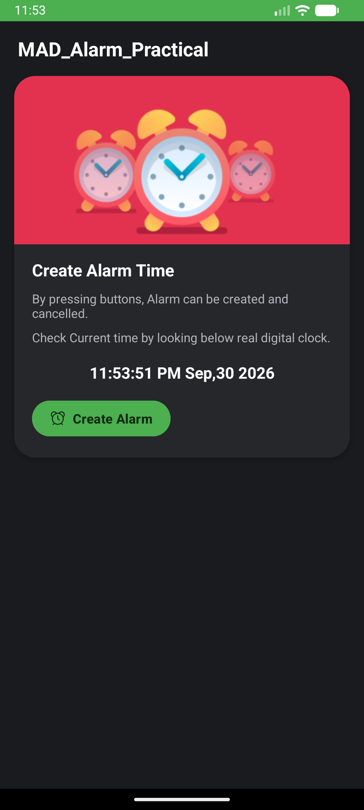
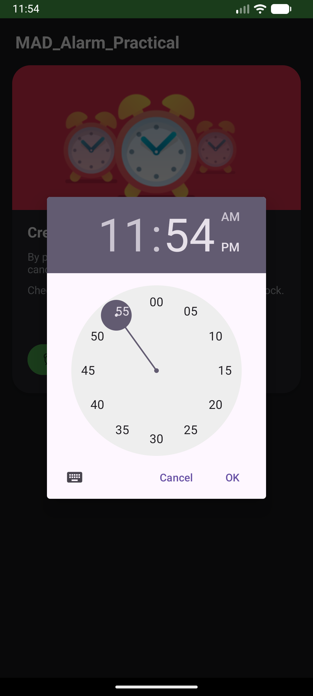
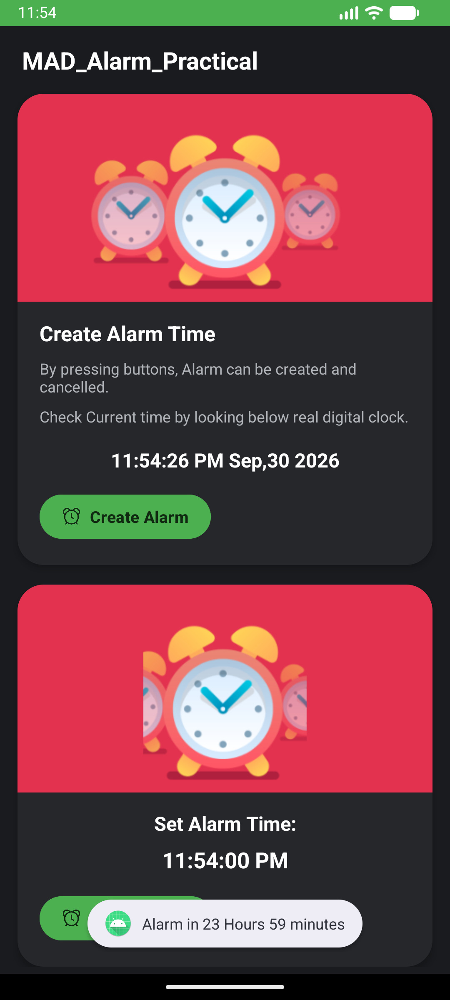

# ⏰ MAD Practical 4 — Alarm Clock Application

An Android alarm clock application built with **Kotlin** that demonstrates the use of **AlarmManager**, **BroadcastReceiver**, and **Foreground Service** to schedule, trigger, and cancel alarms with audio playback and notifications.

---

## 📋 Student Details

| Field | Details |
|---|---|
| **Name** | Maharsh Patel |
| **Enrollment No.** | 24012011102 |
| **Course** | 2CEIT5PE18 – Mobile Application Development (MAD) |
| **Practical** | Practical 4 |

---

## 🎯 Objective

To implement an Android application that allows users to set and cancel alarms using the system `AlarmManager`, handle alarm events via a `BroadcastReceiver`, and play an alarm sound through a `Foreground Service` with an accompanying notification.

---

## 🏗️ Project Structure

```
app/src/main/
├── java/com/example/mad_practical4_24012011102/
│   ├── MainActivity.kt              # Main UI – time picker, set/cancel alarm
│   ├── AlarmBroadcastReceiver.kt     # Receives alarm broadcast & starts/stops service
│   └── AlarmService.kt              # Foreground service – plays alarm sound & shows notification
├── res/
│   ├── layout/
│   │   └── activity_main.xml        # UI layout with MaterialCardViews
│   ├── drawable/
│   │   ├── alarm_outlined_alert_clock_icon.png
│   │   ├── cancel_alarm_1.png
│   │   └── image_1.png
│   ├── raw/
│   │   └── alarm.mp3               # Alarm ringtone audio file
│   ├── values/
│   │   ├── colors.xml              # Custom dark theme color palette
│   │   └── themes.xml              # Material3 NoActionBar theme
│   └── values-night/               # Night mode theme overrides
└── AndroidManifest.xml             # Permissions, service & receiver declarations
```

---

## ⚙️ How It Works

### 1. Setting an Alarm (`MainActivity.kt`)
- User taps the **"Create Alarm"** button, which opens a `TimePickerDialog`.
- The selected time is converted to a `Calendar` instance; if the time has already passed today, it automatically schedules for the next day.
- The alarm is registered via `AlarmManager.setExact()` with `RTC_WAKEUP` to fire even when the device is asleep.
- A `Toast` message shows the remaining time until the alarm.

### 2. Receiving the Alarm (`AlarmBroadcastReceiver.kt`)
- When the scheduled time arrives, the system delivers a broadcast to `AlarmBroadcastReceiver`.
- The receiver reads the intent extra (`"Start"` or `"Stop"`) and starts or stops the `AlarmService` accordingly.
- On Android O+, it uses `startForegroundService()` for compatibility.

### 3. Playing the Alarm (`AlarmService.kt`)
- A **foreground service** creates a notification channel (`"Alarm Playing Service"`) and posts a high-priority notification titled *"MAD Alarm Ringing"*.
- A `MediaPlayer` loops the `alarm.mp3` file from `res/raw/` until the service is stopped.
- On destroy, the `MediaPlayer` is properly released to free resources.

### 4. Cancelling the Alarm
- User taps **"Cancel Alarm"**, which calls `AlarmManager.cancel()` on the pending intent and broadcasts a stop intent to halt the service.
- The cancel card is hidden and the create card is shown again.

---

## 🔒 Permissions

Declared in `AndroidManifest.xml`:

| Permission | Purpose |
|---|---|
| `SCHEDULE_EXACT_ALARM` | Schedule precise alarms via `AlarmManager` |
| `USE_EXACT_ALARM` | Alternative exact alarm permission |
| `FOREGROUND_SERVICE` | Run the alarm service in the foreground |
| `FOREGROUND_SERVICE_MEDIA_PLAYBACK` | Foreground service type for audio playback |
| `POST_NOTIFICATIONS` | Display alarm notification on Android 13+ |

---

## 🎨 UI Design

- **Dark theme** with a custom color palette (`#1A1B1E` background, `#25272B` card surfaces).
- **Material Design 3** components — `MaterialCardView`, `MaterialButton`, `MaterialTextView`.
- **ConstraintLayout** with `NestedScrollView` for a responsive, scrollable layout.
- **Live `TextClock`** widget displaying the current time in `hh:mm:ss a MMM,dd yyyy` format.
- **Green accent** (`#4CAF50`) on buttons and status bar for visual consistency.
- Two `MaterialCardView` sections:
  - **Create Alarm** card — with an image, description, live clock, and a create button.
  - **Cancel Alarm** card — appears after an alarm is set, showing the scheduled time and a cancel button.

---

## 📸 Output Screenshots

| Home Screen | Time Picker Dialog | Alarm Set |
|:-----------:|:------------------:|:---------:|
|  |  |  |

**Screen Descriptions:**

1. **Home Screen** — Main UI displaying the *Create Alarm* card with an alarm clock banner, description text, live `TextClock` widget, and the green **"Create Alarm"** button.
2. **Time Picker Dialog** — Material time picker dialog that appears when the user taps "Create Alarm", allowing selection of hour and minutes in a circular dial.
3. **Alarm Set** — After setting an alarm, both cards are visible — the *Create Alarm* card and the *Cancel Alarm* card showing the scheduled time (`11:54:00 PM`) and remaining duration (`23 Hours 59 minutes`).

---

## 🛠️ Tech Stack

| Component | Technology |
|---|---|
| **Language** | Kotlin |
| **Min SDK** | 31 (Android 12) |
| **Target SDK** | 34 (Android 14) |
| **Compile SDK** | 35 |
| **UI Toolkit** | Android XML Layouts |
| **Design System** | Material Design 3 (`Theme.Material3.DayNight.NoActionBar`) |
| **Build System** | Gradle (Kotlin DSL) |
| **Key Libraries** | AndroidX Core KTX, AppCompat, Material, ConstraintLayout, Activity |

---

## 🚀 Getting Started

### Prerequisites
- Android Studio (Arctic Fox or later)
- JDK 1.8+

### Run the Project
1. Clone the repository:
   ```bash
   git clone https://github.com/maharsh-patel/MAD_24012011102_Practical_4.git
   ```
2. Open the project in Android Studio.
3. Sync Gradle and build the project.
4. Run on an emulator or physical device (API 31+).

---

## 📄 License

This project is developed as part of academic coursework at **U. V. Patel College of Engineering (UVPCE)**.
